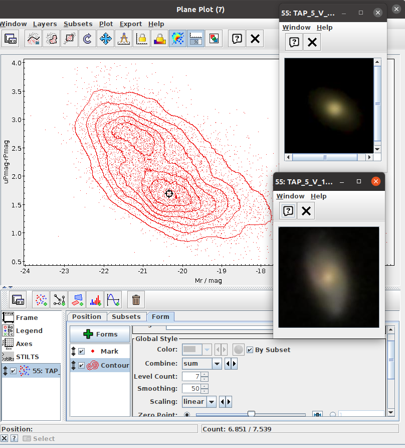

# Astronomical Databases and TOPCAT

### A hands-on workshop: finding galaxy bimodality in SDSS

---

## 🌐 Choose your language / Elige tu idioma / Escolha seu idioma

| | | |
|:---:|:---:|:---:|
|**[English](TOPCAT-workshop-EN.md)** | **[Español](TOPCAT-workshop-ES.md)** | **[Português](TOPCAT-workshop-PT.md)** |
| *main version* | *traducción* | *tradução* |

> **Note:** TOPCAT's interface is in English. In all three versions, **menu names, buttons and
> column names are kept in English** (`Views → Column Statistics`, `uPmag`, `nGood`) so that
> what you read matches what you see on screen.

---

## What you will do

Starting from nothing, you will pull a sample of galaxies from a public archive, clean it,
compute their absolute magnitudes, and discover that galaxies come in **two distinct
families**, one red and dead, one blue and star-forming.

You will then click on a point in your plot and **see the galaxy**.

Finally, you will cross-match with **Galaxy Zoo** and test, on three thousand galaxies,
whether colour really predicts morphology.

**No code. Ninety minutes.**



---

## Contents of this repository

| File | What it is |
|---|---|
| **`TOPCAT-workshop-EN.md`** | The tutorial, **main version** |
| `TOPCAT-workshop-ES.md` | Spanish translation |
| `TOPCAT-workshop-PT.md` | Portuguese translation |
| **[`Astronomical-Databases-Workshop.pptx.pdf`](Astronomical-Databases-Workshop.pptx.pdf)** | **The slides.** 21 slides, with speaker notes. |
| **`sdss_stripe82_galaxies.vot`** | **The data.** Use this if the archive is slow or down. |
| `images/` | Figures |

### The slides

[**`Astronomical-Databases-Workshop.pptx`**](Astronomical-Databases-Workshop.pptx), the deck used to teach this
workshop. Roughly ten minutes of context on SIMBAD, VizieR, Aladin and TOPCAT, then screenshots
walking through each step of the analysis, ending with the Galaxy Zoo cross-match.

**Every slide has speaker notes** (`View → Notes Page`) saying what to say and where students
tend to get stuck.

---

## Before you start

### 1. Install TOPCAT

Download **`topcat-full.jar`** from
[the official page](https://www.star.bris.ac.uk/~mbt/topcat/).

> ⚠️ Get the **full** jar, not the "lite" one — you will need the extras.

You need Java. Check with:

```bash
java -version
```

Run it with:

```bash
java -jar topcat-full.jar
```

**Java is slow to start. Open TOPCAT at the beginning of the session and leave it open.**

### 2. Download the backup data

Get **`sdss_stripe82_galaxies.vot`** from this repository **now**, before the session.

You will query the archive live during the workshop — but archives get slow when twenty people
hit them at once. If your query stalls, load this file instead and carry on. **You lose
nothing.**

---

## What this workshop is really about

Not TOPCAT. TOPCAT is buttons; you can look those up.

It is about a **habit of suspicion**:

> **The database will never tell you that you asked the wrong question.**
>
> **The plot will never tell you that you plotted the wrong column.**
>
> **The flag will never tell you that it missed something.**
>
> **That is your job.**

The tutorial contains **twelve traps**. Every one of them produces output that looks
completely fine. None of them throws an error.

---

## Data credits

- **SDSS DR16** , `V/154/sdss16` via [VizieR](https://vizier.cds.unistra.fr/), CDS Strasbourg
- **Galaxy Zoo 1** , Lintott et al. 2011, MNRAS 410, 166, `J/MNRAS/410/166`
- **K-corrections** — Chilingarian, Melchior & Zolotukhin 2010, MNRAS 405, 1409
- **Cosmological distances** , Hogg 2000, [astro-ph/9905116](https://arxiv.org/abs/astro-ph/9905116)
- **TOPCAT** , M. B. Taylor 2005, ASP Conf. Ser. 347, 29

## Further reading

For the wider picture, what the Virtual Observatory set out to do, and how far it had got,
start here:

> Chilingarian, I. V. (2009). *Virtual Observatory for Astronomers: Where Are We Now?*
> In D. Baines & P. Osuna (eds.), **Multi-wavelength Astronomy and Virtual Observatory**, p. 165.
> [arXiv:0903.0424](https://arxiv.org/abs/0903.0424) ·
> [ADS](https://ui.adsabs.harvard.edu/abs/2009mavo.proc..165C)

Worth noting: this is the same author whose K-corrections you apply in Part 4 when you compute
`Mr`. The paper is a good companion to Part 1 of the tutorial, it explains why the standards
exist rather than just how to click through them.

---

## On the use of AI

**[Claude](https://claude.ai) (Anthropic) was used to write and translate these materials.**
Being explicit about this seems more useful than being vague about it, particularly in a
workshop whose entire argument is that you should know where your outputs came from.

**What the AI did:** drafted the prose of the tutorial, produced the Spanish and Portuguese
translations, and built the slides.

**What it did not do:** the science. The choice of question, the sample, the photometry, the
quality cuts, every query, and every result in this repository were decided, executed and
verified by the author in TOPCAT. The twelve traps are not hypothetical, they are mistakes
encountered while building this analysis, which is why they are in it.

The same standard the workshop asks of a catalogue applies here: **a tool that produces
plausible output is not a tool that produces correct output.** Verify it yourself. That
includes this.

---

*Gissel Montaguth · [@GMontaguth](https://github.com/GMontaguth)*
